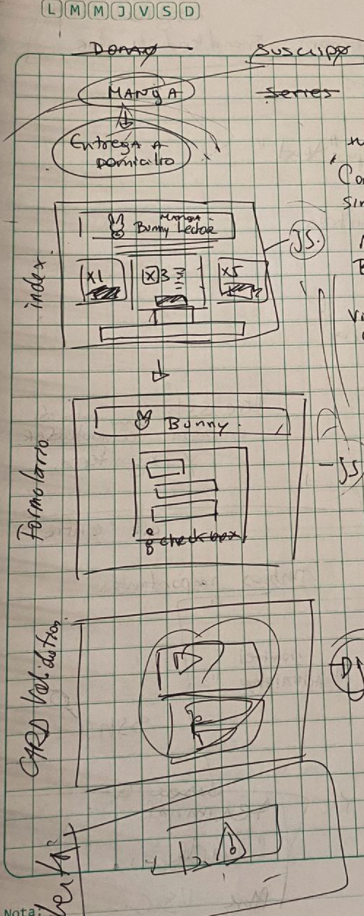
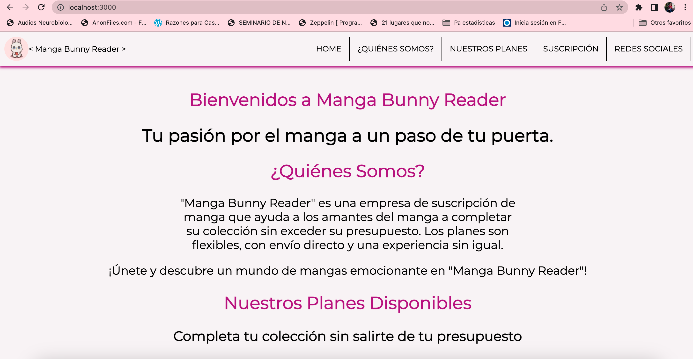
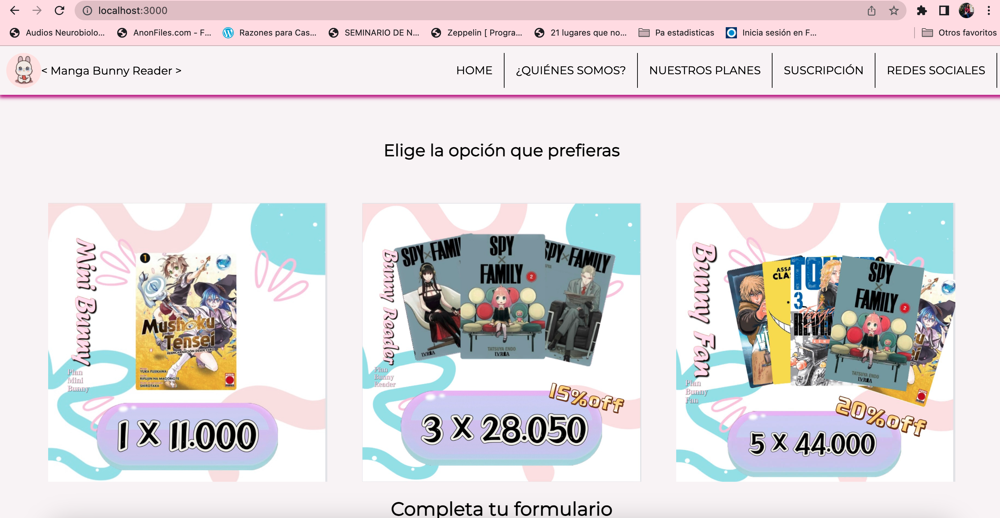
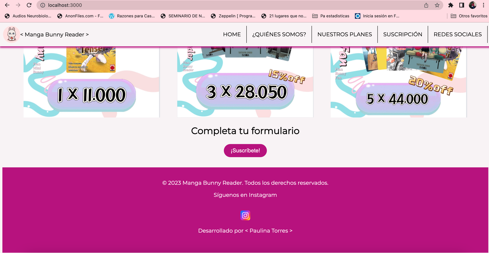
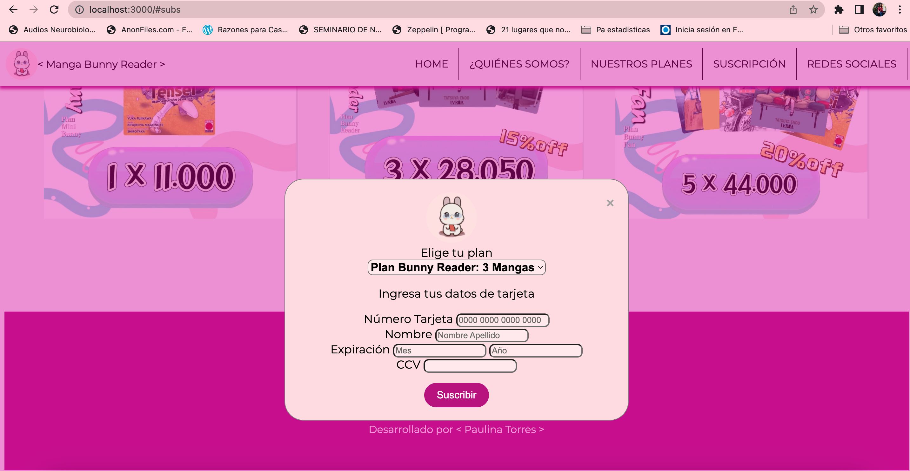
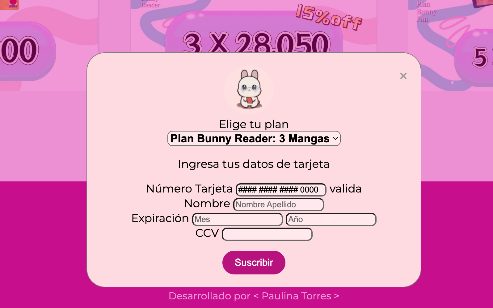
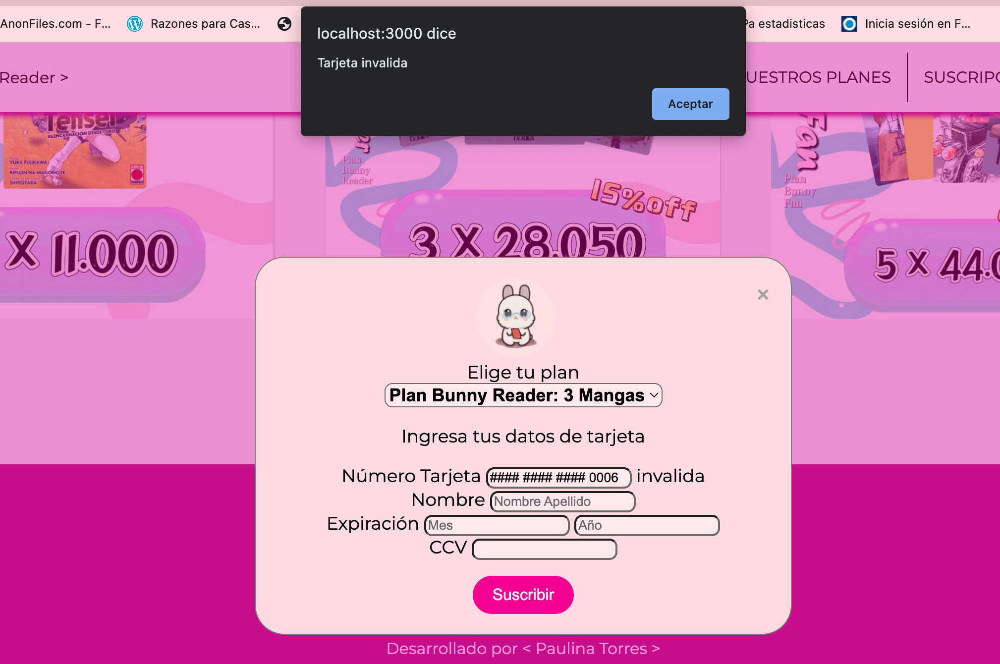

# Proyecto Card Validation <L>

## Contenido

1. Preámbulo
2. Definición del Proyecto
3. Consideraciones generales del perfil del usuario y nuestro producto
4. Flujo de trabajo
5. Tecnologías Utilizadas
6. Estructura de archivos
7. Instrucciones de Uso
8. Página Web
9. Autor

***

## 1. Preámbulo

Este proyecto tiene como objetivo adquirir conocimientos a través de una situación y contexto ficticio llamado "Manga Bunny Reader", para realizar la validación de una tarjeta de crédito utilizando el algoritmo de Luhn.

## 2. Definición del proyecto

Manga Bunny Reader es una aplicación web para la suscripción de mangas que permite a los amantes del manga completar su colección de forma fácil y accesible. Este proyecto utiliza HTML, CSS y JavaScript para su implementación.

## 3. Consideraciones generales del perfil del usuario y nuestro producto

Nuestro producto está dirigido a jóvenes adultos con intereses definidos en el anime, manga y cultura japonesa en general, pero también con responsabilidades y demandas del mundo real.

## 4. Flujo de trabajo

En cuanto al diseño de la página, lo primero después de definir el contexto fue desarrollar un prototipo de baja calidad utilizando lápiz y papel.

Se definió el nombre del proyecto, "Manga Bunny Reader", y se asoció gradualmente una identidad que conectara con los usuarios y transmitiera la idea principal. Además, se creó un primer logo para representar la marca.

Después de escribir el código y darle una estructura y funcionalidad inicial, se realizaron varias modificaciones al diseño original. En lugar de utilizar múltiples ventanas para mostrar los diferentes formularios, se optó por utilizar una página principal y una ventana tipo modal. Esta elección favoreció la experiencia del usuario más amena.

En cuanto a la funcionalidad de la página, se siguieron los siguientes pasos:

Se buscó comprender el algoritmo de Luhn, que es necesario para realizar la validación de la tarjeta de crédito. Este algoritmo permite verificar la validez de los números de tarjeta ingresados por los usuarios.

Tras la implementación de la función isValid, que realiza la validación de la tarjeta, se procedió a desarrollar la función maskify. Esta función oculta todos los caracteres de la tarjeta, excepto los últimos cuatro, reemplazándolos con el símbolo "#". Luego, los últimos cuatro caracteres se concatenan sin modificar.

Estos pasos fueron importantes para el desarrollo del proyecto y aseguraron la comprensión del algoritmo de validación y la implementación de la funcionalidad requerida.

## 5. Tecnologías Utilizadas

El proyecto utiliza las siguientes tecnologías:

- HTML: Para estructurar y definir el contenido del sitio web.
- CSS: Para estilizar y dar formato al contenido del sitio web.
- JavaScript: Para agregar interactividad y funcionalidad al sitio web.

## 6. Estructura de archivos

El proyecto está organizado de la siguiente manera:

- `index.html`: Este archivo contiene el código HTML del sitio web, que define la estructura y contenido de las páginas.
- `index.js`: Este archivo contiene el código JavaScript del sitio web, encargado de manejar la interacción del usuario y realizar validaciones.
- `validator.js`: Este archivo contiene una función para validar números de tarjeta de crédito.
- `style.css`: Este archivo contiene los estilos CSS del sitio web, aplicados para darle una apariencia visual atractiva.

## 7. Instrucciones de Uso

Para utilizar este proyecto, sigue estos pasos:

1. Clona este repositorio en tu máquina local.
2. Abre el archivo `index.html` en tu navegador web a través de la terminal usando "npm run start".
3. Explora las diferentes secciones de la aplicación, como "¿Quiénes Somos?", "Nuestros Planes", "Suscripción" y "Redes Sociales".
4. Utiliza el botón "Suscríbete" para abrir un formulario de suscripción modal.
5. Completa el formulario con tus datos de tarjeta y elige el plan de suscripción deseado.
6. Haz clic en el botón "Suscribir" para procesar la suscripción. Se aplicará una máscara al número de tarjeta y se realizará una validación básica.
7. ¡Disfruta de una experiencia emocionante en Manga Bunny Reader!

## 8. Página Web

Esta es la interfaz final de la aplicación web Manga Bunny Reader:

Aquí se muestra desplegada la ventana tipo modal:

Y esta es la alerta respectiva de la validación de la tarjeta, en caso de ser válida:

En caso de no ser válida:

## 9. Autor

- Paulina Torres
